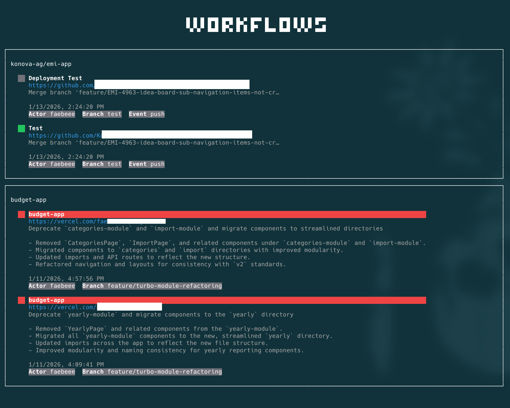
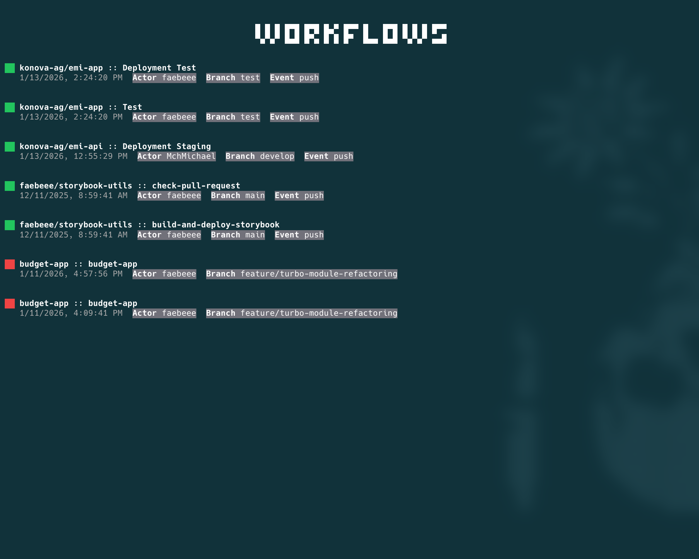

# Status Tray TUI

A terminal-based UI to display project statuses from various sources like GitHub and Vercel. This tool provides a unified dashboard to monitor the status of all your projects in an elegant terminal interface.




## Features

- **Unified Dashboard:** View the status of all your projects in a single terminal interface.
- **GitHub Integration:** Monitor the status of your Git repositories.
- **Vercel Integration:** Keep an eye on your Vercel project deployments.
- **Filtering:** Quickly filter to show only projects with failed statuses.
- **Minimalist View:** A compact view option for a more focused overview.
- **Extensible:** The architecture allows for adding support for more services.

## Installation

1. `npm install -g status-tray-tui`

## Configuration

The application requires authentication tokens for the services you want to monitor. Set the following environment variables:

- `GITHUB_TOKEN`: Your GitHub Personal Access Token.
- `VERCEL_BEARER`: Your Vercel API Token.

Example:
```bash
export GITHUB_TOKEN=your_github_token
export VERCEL_BEARER=your_vercel_token
```

## Usage

To start the application in development mode, run:

```bash
status-tray-tui --git owner/repo1 --git owner/repo2 --vercel project1 --vercel project2
```

### CLI Arguments

- `--git`: Specify one or more GitHub repositories to monitor (e.g., `owner/repo`).
- `--vercel`: Specify one or more Vercel projects to monitor.
- `--minimal`: Start the application in minimalist view.

### Keyboard Shortcuts

- `x`: Toggle "Show Only Failed" filter.
- `Ctrl + L`: Toggle the console view (for debugging).
- `Ctrl + C`: Exit the application.


This project was bootstrapped with `bun create tui` and is built with [OpenTUI](https://github.com/OpenTUI/OpenTUI).
